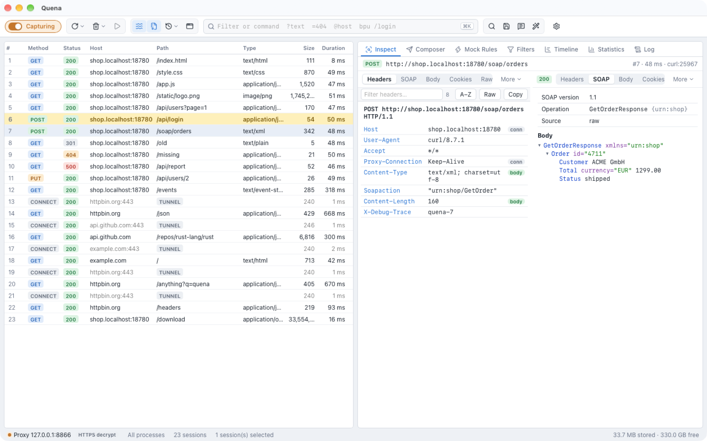
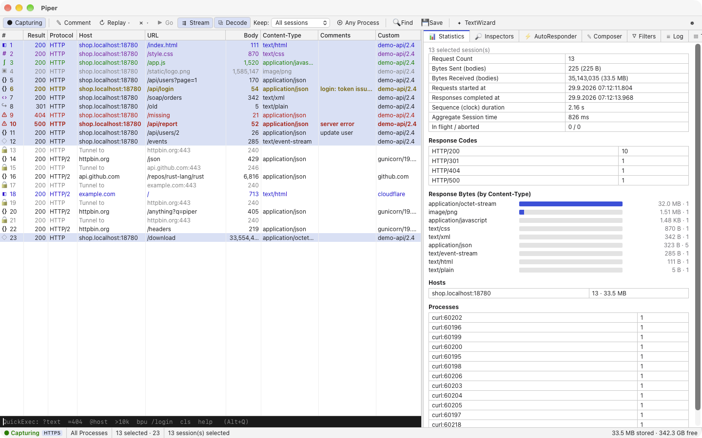
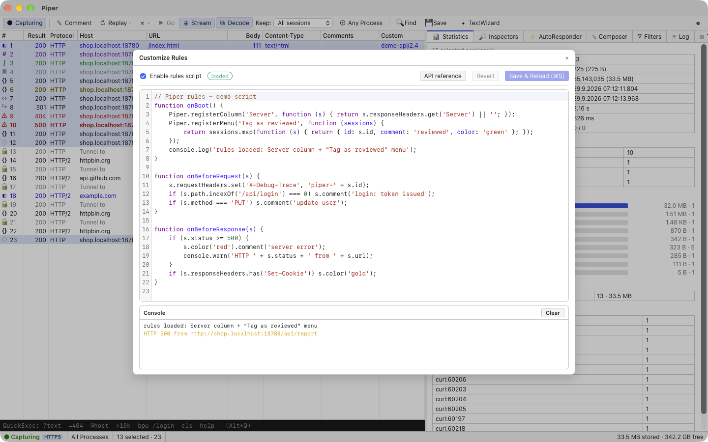
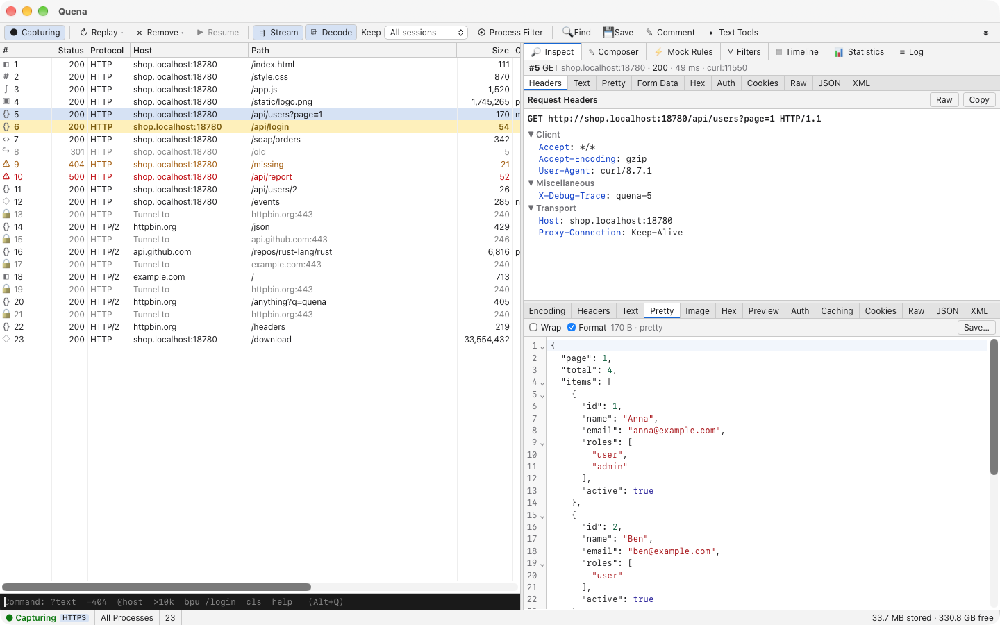

<div align="center">


# Quena

**The easy, intuitive — yet seriously powerful — HTTP(S) debugging proxy. On every desktop.**

Capture, inspect, change and replay HTTP(S) traffic — on macOS, Windows and Linux.

[](https://github.com/hkiam/quena/actions/workflows/ci.yml)
[](LICENSE)


[Why Quena?](#why-quena) ·
[Features](#features) ·
[Screenshots](#screenshots) ·
[Getting started](#getting-started) ·
[Scripting](#scripting) ·
[Architecture](#architecture) ·
[Contributing](#contributing)

<br>


</div>

---

## Why Quena?

On Windows, tools such as Fiddler Classic showed how productive an HTTP debugging proxy can be:
a dense session list, inspectors right next to it, keyboard-driven, and powerful enough to break,
tamper, replay or script any request — without getting in the way. Developers on macOS and Linux,
and teams working across platforms, have had few free tools of that kind.

Quena is an independent, open-source take on this kind of tool, with its own design, for
**every desktop platform**:

- **Easy to use.** Start Quena, and traffic appears. HTTPS decryption is one checkbox and one
  "Trust" click. No accounts, no cloud, no setup wizard marathon.
- **Intuitive.** A keyboard-driven workspace with a command field and palette, Mock Rules, a
  Composer and inspectors that pick the right view for the content. Coming from Fiddler
  Classic? Your `.saz` sessions and `.farx` rules import directly, and the filter syntax and
  shortcuts will feel familiar — see [Coming from Fiddler Classic](docs/coming-from-fiddler.md).
- **Powerful.** Breakpoints and tampering, mock rules, replay, JavaScript rules,
  WASM plugins, enterprise authentication (NTLM/Kerberos), PAC, mTLS, bandwidth simulation,
  and inspectors for WebSocket, SSE, gRPC, SOAP, OData and MTOM.
- **Fast, even when traffic is not friendly.** Hundreds of thousands of sessions and
  multi-gigabyte response bodies with constant memory; the UI never waits on the core.
- **Local and private by design.** Everything stays on your machine. The root certificate is
  generated locally, decryption is opt-in, credentials live in the OS secure store,
  and there is no telemetry.
- **Open source.** Apache-2.0 licensed, built in the open, contributions welcome.

> Quena is an independent project. It is not affiliated with, endorsed by, or connected to
> Progress Software Corporation or the Fiddler product family. *Fiddler* is a trademark of its
> respective owner and is mentioned here only to describe familiarity and compatibility.

---

## Features

<table>
<tr>
<td valign="top" width="50%">

### Capture
- HTTP/1.1, **HTTP/2**, HTTPS (on-the-fly certificates), CONNECT tunnels
- **WebSocket** frames and **Server-Sent Events**, live
- System proxy on macOS, Windows and Linux (GNOME, KDE) — restored on quit *and* after a crash
- Upstream proxy chaining, bypass list, **PAC** (proxy auto-config)
- Remote devices: allow-list, landing page `http://quena.cert`,
  **QR-code device assistant** for iOS and Android
- Process attribution (which app sent the request)

### Inspect
- Headers, Text, Pretty, Form Data, Hex, Auth, Cookies,
  Raw, JSON, XML, Caching, Image, Preview, Encoding
- Auto-detected inspectors: **WebSocket**, **SSE**, **gRPC / Protobuf**
  (schemaless), **Multipart / MTOM**, **SOAP**, **Atom / OData**
- **Fast Infoset** (SOAP, OData, EDMX) via bundled plugin
- Transparent gzip / deflate / brotli / zstd decoding, with bomb protection
- Large-body viewer: open a multi-GB body instantly, search it, save ranges

</td>
<td valign="top" width="50%">

### Change & replay
- **Mock Rules** with `.farx` import/export
- **Breakpoints & tamper** before request / after response
- **Composer** (parsed, raw, history) with **cURL import**
- Replay: again, unconditionally, *n* times, sequentially, with edit
- **JavaScript rules** with hot reload,
  custom menu commands and a custom column

### Analyze
- **Command field** (`?text`, `@host`, `=404`, `>10k`, `bpu`, `g` …) and **command palette** (`Ctrl/⌘ K`)
- Filters, Find, Statistics, Timeline, Compare, Text Tools
- Comments, color marks, custom column

### Enterprise-ready
- **Automatic authentication**: NTLM, Negotiate/Kerberos, Basic —
  single sign-on via Windows SSPI and Kerberos tickets on macOS and Linux
- **Client certificates (mTLS)** per host
- **Bandwidth & latency simulation**
- Import/export **SAZ** (compatible with Fiddler Classic), **HAR 1.2**, copy as cURL

</td>
</tr>
</table>

---

## Screenshots

<table>
<tr>
<td width="50%">

<p align="center"><sub><b>SOAP & XML</b> — pretty-printed, with auto-detected SOAP and Atom/OData inspectors</sub></p>
</td>
<td width="50%">

<p align="center"><sub><b>Statistics</b> — timing, status codes and bytes by content type for any selection</sub></p>
</td>
</tr>
<tr>
<td width="50%">

<p align="center"><sub><b>JavaScript rules</b> — hooks, custom menu and column, live console</sub></p>
</td>
<td width="50%">

<p align="center"><sub><b>Classic layout</b> — optional: denser list, request above response</sub></p>
</td>
</tr>
</table>

---

## Keyboard & command field

| Action | Quena | |
|---|---|---|
| Start / stop capturing | `F12` | |
| Break before requests / after responses / off | `F11` / `Alt F11` / `Shift F11` | |
| Resume all paused sessions | command `g` | |
| Rules Script (scripting) | `Ctrl/⌘ R` | |
| Focus the command field | `Alt Q` | |
| Command palette | `Ctrl/⌘ K` | |
| Statistics / Inspect | `F7` / `F8` | |
| Composer | `F9` | |
| Text Tools | `Ctrl/⌘ E` | |
| Find sessions | `Ctrl/⌘ F` | |
| Mark session red … purple / unmark | `Ctrl/⌘ 1` … `6` / `Ctrl/⌘ 0` | |

Command field examples:

```text
?login        select sessions whose URL contains "login"
@github.com   select sessions for a host
=500          select by status code (or =POST for a method)
>100k         select responses larger than 100 KB
bpu /api      break before requests matching /api
bps 500       break on responses with status 500
keeponly json keep only JSON responses
tail 1000     keep the 1000 most recent sessions
dump          save everything as a .saz archive
```

Quena listens on **port 8866** by default. Layout: Quena's own arrangement by default, or **Classic** (dense list, request above response) in *Settings → General*.

---

## Getting started

### Install

Download the installer for your platform from the
[Releases](https://github.com/hkiam/quena/releases) page: macOS (`.dmg`, Apple Silicon), Windows
(`.exe` / `.msi`) and Linux (`.deb`, `.rpm`, AppImage).

The packages are not signed with a paid certificate or notarized yet. On macOS, open
*System Settings → Privacy & Security* after the first launch attempt and choose *Open Anyway*;
on Windows, SmartScreen may ask you to confirm (*More info → Run anyway*).

### Build from source

Requirements: [Rust](https://rustup.rs) **1.95+**, [Node.js](https://nodejs.org) **20.19+** (or 22.12+), and the
[Tauri 2 prerequisites](https://tauri.app/start/prerequisites/) for your platform.

```bash
git clone https://github.com/hkiam/quena.git
cd quena

# UI dependencies
npm ci --prefix app/ui

# Bundled plugins (optional, e.g. Fast Infoset) — built as WebAssembly components
rustup target add wasm32-wasip2
./plugins/build.sh

# Run in development mode
npm exec --prefix app/ui -- tauri dev

# …or build an installable bundle
npm exec --prefix app/ui -- tauri build
```

Run the test suite:

```bash
cargo test --workspace --exclude quena-app
npm run build --prefix app/ui      # typecheck + production build of the UI
npm test --prefix app/ui           # UI unit tests (Vitest)
```

### First capture

1. Start Quena. It begins capturing and — with *Act as system proxy* in *Settings → Connections* (on by default) — registers
   itself as the system proxy (the previous proxy is kept as upstream and restored on exit). On Linux this
   is the GNOME or KDE Plasma proxy setting that browsers follow.
2. Browse. Sessions appear live in the list; select one to inspect it.
3. Want HTTPS content? Open **Capture → HTTPS Settings…**, enable *Decrypt HTTPS traffic* and click
   **Trust root certificate**. The certificate is generated on your machine and never leaves it.
   On Linux, Quena adds it to Chrome's and Firefox's certificate databases and — after asking for
   your password — to the system store used by curl and other tools.
4. Command-line tools work too: `curl -x http://127.0.0.1:8866 https://example.com`.

### Phones, tablets and VMs

Open **Capture → Connect Device…**, allow remote connections, and scan the QR code with the device.
It leads to `http://quena.cert`, which serves the certificate (`.crt` for Android,
`.mobileconfig` for iOS) together with step-by-step instructions.

---

## Scripting

Quena embeds a sandboxed JavaScript engine (QuickJS) for rules scripts.
Open **Capture → Rules Script…** (`Ctrl/⌘ R`), edit, and press `Ctrl/⌘ S` — the script reloads
instantly and errors appear inline.

```js
function onBoot() {
    // A "Custom" column filled from each response
    Quena.registerColumn('Server', s => s.responseHeaders.get('Server') || '');

    // A command in the session context menu (right click → Scripts)
    Quena.registerMenu('Tag as reviewed', sessions =>
        sessions.map(s => ({ id: s.id, comment: 'reviewed', color: 'green' })));
}

function onBeforeRequest(s) {
    s.requestHeaders.set('X-Debug-Trace', 'quena-' + s.id);
    if (s.host === 'ads.example.com') s.abort();
    if (s.path === '/api/feature-flags') s.respond(200, '{"newCheckout":true}',
                                                   { 'Content-Type': 'application/json' });
}

function onBeforeResponse(s) {
    if (s.status >= 500) s.color('red').comment('server error');
    s.responseHeaders.remove('Strict-Transport-Security');
}
```

Scripts run off the proxy threads with a time and memory budget and have no file-system,
network or environment access. A script that does not answer within 2 s is skipped for that
request, so a slow script degrades to "no rules" instead of stalling traffic. They see headers and metadata only — bodies keep streaming,
so enabling a script never turns a 5 GB download into a 5 GB buffer.
Full API: [`crates/quena-script/src/quena.d.ts`](crates/quena-script/src/quena.d.ts) ·
Design notes: [`docs/m14-scripting-and-pac.md`](docs/m14-scripting-and-pac.md)

## Plugins

Inspectors and decoders can be added as **WebAssembly components** (WASI Preview 2, see
[`wit/plugin.wit`](wit/plugin.wit)). Plugins are sandboxed — no file-system, network or
environment access, with memory and time limits — and stream their input and output, so they
are safe to run on untrusted, huge payloads. The bundled
[Fast Infoset plugin](plugins/fast-infoset) is a complete example.

---

## Platform support

|                           | macOS            | Windows                      | Linux                                   |
|---------------------------|------------------|------------------------------|-----------------------------------------|
| Capture, inspect, tamper  | ✅               | ✅                           | ✅                                      |
| System proxy integration  | ✅               | ✅                           | ✅ GNOME, KDE Plasma                     |
| Trust root certificate    | ✅ Keychain      | ✅ user certificate store     | ✅ Chrome/Firefox (NSS), system store¹   |
| Process attribution       | ✅               | ✅                           | ✅ own processes (`/proc`)               |
| Single sign-on auth       | ✅ Kerberos      | ✅ NTLM + Kerberos (SSPI)     | ✅ Kerberos (GSSAPI, `kinit`)²           |
| Credentials storage       | ✅ Keychain      | ✅ Credential Manager         | ✅ Secret Service (GNOME Keyring, KWallet)³ |
| Packages                  | `.dmg`           | NSIS `.exe`, `.msi`          | `.deb`, `.rpm`, AppImage                |
| Continuous integration    | ✅               | ✅                           | ✅ Ubuntu 22.04                          |

On Linux, Quena uses these optional tools when they are installed (the `.deb`/`.rpm` recommend them):
`certutil` (libnss3-tools / nss-tools) for browser trust, `pkexec` for the system trust store
(curl, wget and most CLI tools), `secret-tool` (libsecret-tools) for the keyring, and the
Kerberos library (libgssapi-krb5). ¹ Updating the system store asks for your password.
² Without the Kerberos library Quena falls back to NTLM. ³ Without a keyring, saved passwords
last until Quena quits. Command-line tools don't follow desktop proxy settings: point
`HTTP_PROXY`/`HTTPS_PROXY` at `http://127.0.0.1:8866` for them.

---

## Architecture

Quena is a Rust core with a thin, fast UI:

```text
┌──────────────────────── Tauri 2 app ────────────────────────┐
│  React + TypeScript UI · canvas session grid · CodeMirror 6  │
│        ▲ viewport rows & deltas (≤ 60 Hz)   ▲ bodies via     │
│        │ async IPC commands                 │ quena:// + Range│
├────────┴────────────────────────────────────┴────────────────┤
│ quena-app-core   commands, jobs, rules, settings, archives    │
│ quena-proxy      hyper/rustls MITM proxy, HTTP/2, WS, auth    │
│ quena-index      incremental sort/filter over 500k sessions   │
│ quena-body       disk-backed bodies, range reads, decoding    │
│ quena-store      capture database (SQLite) + recovery         │
│ quena-tls        root CA, per-host certificates, mTLS         │
│ quena-auth       NTLMv2, Negotiate/Kerberos (GSS, SSPI)       │
│ quena-script     QuickJS rules + PAC evaluation               │
│ quena-plugin-host  Wasmtime component host (sandboxed)        │
│ quena-formats    SAZ, HAR, cURL, raw HTTP                     │
│ quena-query · quena-model · quena-jobs · quena-platform       │
└───────────────────────────────────────────────────────────────┘
```

Two principles shape every component:

1. **Bodies can be huge.** Memory per session is O(1) in body size. Bodies never travel over IPC,
   into React state or into the DOM as a whole; every operation — viewing, searching, decoding,
   exporting — is streaming or windowed. See the large-body tests in
   [`crates/quena-body/tests`](crates/quena-body/tests).
2. **The UI never waits.** The core owns all state; the UI renders a viewport. Anything that can
   take time is a cancellable job, and list updates are coalesced with back-pressure.
   See the performance guards in [`crates/quena-index/tests/perf.rs`](crates/quena-index/tests/perf.rs).

The full design and roadmap live in [`PLAN.md`](PLAN.md) (German).

---

## Security & privacy

- Quena runs **entirely locally**. There is no account, no cloud service and no telemetry.
- The root certificate and its private key are **generated on your machine** and stored in
  Quena's data directory. You decide whether to trust it, and you can remove it at any time.
- HTTPS decryption is **opt-in**, can be scoped (browsers only, non-browsers, remote clients)
  and can exclude hosts entirely.
- Stored credentials for automatic authentication live in the **OS secure store**
  (Keychain / Credential Manager / Secret Service) — never in plain-text settings. Auth headers are
  redacted in logs.
- Built for **broken and hostile traffic**: stalled clients and servers time out, decompression,
  imports and inspectors have size limits, a request loop back into Quena is refused, and a view
  that cannot render a payload shows an error instead of taking the window down. Damaged state
  files (settings, rules, certificate, database) are set aside instead of blocking the start.
- Remote connections are **off by default** and restricted by an allow-list when enabled.

Please report vulnerabilities privately — see [SECURITY.md](SECURITY.md).

---

## Roadmap

- Signed and notarized releases for macOS and Windows
- Capture without a system proxy (macOS Network Extension), HAR live import, remote capture
- "Any Process" window picker for process filters
- HTTP/3 (QUIC)

Ideas and feedback are welcome in [Discussions](https://github.com/hkiam/quena/discussions) and
[Issues](https://github.com/hkiam/quena/issues).

---

## Contributing

Contributions of all sizes are welcome — bug reports, documentation, inspectors, plugins, platform
support. Please read [CONTRIBUTING.md](CONTRIBUTING.md) before opening a pull request.

All dependencies must use permissive licenses (MIT, Apache-2.0, BSD, ISC, Zlib …); this is checked
in CI with [`cargo-deny`](deny.toml).

## License

Quena is licensed under the [Apache License, Version 2.0](LICENSE).

Copyright © 2026 Maik Hofmann and Quena contributors.

## Acknowledgements

Quena stands on the shoulders of great open-source projects, among them
[Tauri](https://tauri.app), [hyper](https://hyper.rs), [rustls](https://github.com/rustls/rustls),
[rcgen](https://github.com/rustls/rcgen), [Tokio](https://tokio.rs),
[Wasmtime](https://wasmtime.dev), [QuickJS](https://bellard.org/quickjs/) via
[rquickjs](https://github.com/DelSkayn/rquickjs), [SQLite](https://sqlite.org) and
[CodeMirror](https://codemirror.net).
