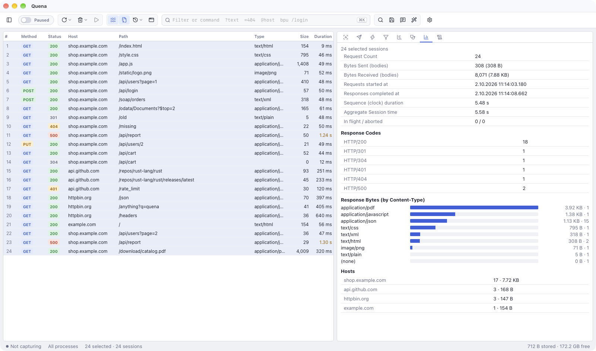

# Analyze

## Statistics

The **Statistics** tab (`F7`) summarises the **selected** sessions — or all sessions when
nothing is selected — and updates while traffic arrives:

- request count, bytes sent and received (bodies), first request and last response,
  clock duration of the sequence, aggregate session time, in-flight and aborted sessions;
- **throughput** (requests and response bytes per second over that duration) and the bytes
  of request and response headers;
- **Durations** of the finished sessions: median and mean, p90 / p95 / p99, minimum and
  maximum, standard deviation;
- **Connection phases (sum)**: DNS lookup, TCP connect, TLS handshake and waiting for the
  first byte, each summed with the number of sessions that had it and the average (a
  selection of more than 20,000 sessions reads the first 20,000 for this);
- **Response Codes**;
- **Response Bytes (by Content-Type)** as bars;
- **Hosts** and **Processes**.

## Timeline

The **Timeline** tab shows the selected sessions (up to 500) as a **waterfall** on a shared
time axis. Each session's bar is split into its phases:

| Phase | Meaning |
|---|---|
| Request from client | Quena receiving the request from the client |
| DNS | resolving the server's name |
| Connect | opening the TCP connection |
| TLS | the TLS handshake with the server |
| Send | sending the request to the server |
| Wait (time to first byte) | waiting for the first byte of the response |
| Receive | receiving the response |

Hover a bar to see the time of each phase; click a row to select that session. The legend
lists the phases that occur; phases without timing data (for example DNS, connect and TLS
on a reused connection) are left out.

## Structure

*Structure* in the [navigator](sessions.md#navigator) shows the sessions the filters let
through as a tree: hosts at the top, then path segments. Each node shows how many sessions
it contains, how many of them are errors and how many bytes were received.

- Expand hosts and folders to drill down; levels load on demand.
- **Click a host or folder to show only its sessions** in the list; click it again (or ✕
  above the list) for all. Right-click → *Select These Sessions* selects them instead —
  then use Statistics, Timeline, Copy, Save or Remove on exactly that part of the traffic.
- A filter box narrows the tree.

## Compare

Select exactly **two** sessions and choose **Compare** from the context menu. Quena shows
both sessions — request line, headers and bodies (up to 256 KB each) — side by side as a
diff.

## Compare captures

*Tools → Compare Captures…* puts two captures side by side: what changed since the last
release, why staging works and production does not, what a new build requests that the old
one did not.

1. Load the captures into the list — *Keep and load* when Quena asks — or use **Load
   archive…** in the dialog. The live capture (what was recorded, not imported) is a side too.
2. Choose **Before** and **After**, then **Compare**. For two hosts — staging against
   production — tick **Ignore host**: requests are then paired by method and path only.

Requests are paired by method, host and path; numbers and ids in the path
(`/users/123`, UUIDs, long hex ids), content hashes in file names (`main.3f9a2c1b.js`,
`index-B2x9kQ1a.js`) and the values of query parameters do not count, and the
n-th call of an endpoint meets the n-th on the other side. The result lists

| Mark | Meaning |
|---|---|
| `~` changed | the status, content type, a response header (added, removed, or the value of `Content-Type`, `Cache-Control`, `Location`, CORS and security headers) or the body differs, or the time is more than twice as long or short (and at least 200 ms apart) |
| `+` new | only in *After* |
| `−` gone | only in *Before* |
| `=` same | nothing of the above (hidden unless chosen) |

**Groups of sessions** compare too: select some sessions and right-click → *Compare Groups →
Use as Before*, then select others → *Compare with Before*. **Pair requests by** *method and
path* (the default, as above), *method and exact URL*, or *order* (the n-th request of each
side with the n-th — two runs of the same steps). **Also ignore headers** takes response
headers that should not count (`X-Request-Id; X-Build`).

Headers that change on every response (`Date`, `ETag`, request ids, `Set-Cookie` …) are
ignored; JSON bodies are compared by content, so key order and spacing do not count.
Requests that answered successfully before and fail now (an error status, or no answer at
all) are counted apart. Click a row to
select its session; double-click a changed one for the [text comparison](#compare) of both.
**Copy as Markdown** puts the result into a ticket or a pull request.

In CI: [`quena-cli diff`](ci.md#comparing-two-captures); for AI agents: the MCP tool
`compare_captures`.

## Text Tools

**Text Tools** (`Ctrl/⌘ E`, *Tools → Text Tools…*, or the wand in the toolbar) convert text
you paste:

| Operation | |
|---|---|
| To Base64 / From Base64 | |
| URLEncode / URLDecode | |
| HTML Encode / HTML Decode | |
| To Hex / From Hex | |
| JS String Escape / JS String Unescape | |
| Decode JWT | header and payload as formatted JSON |
| Unix time → Date | seconds, milliseconds or microseconds, as ISO and local time |
| UTF-8 bytes | the UTF-8 byte values of the text |
