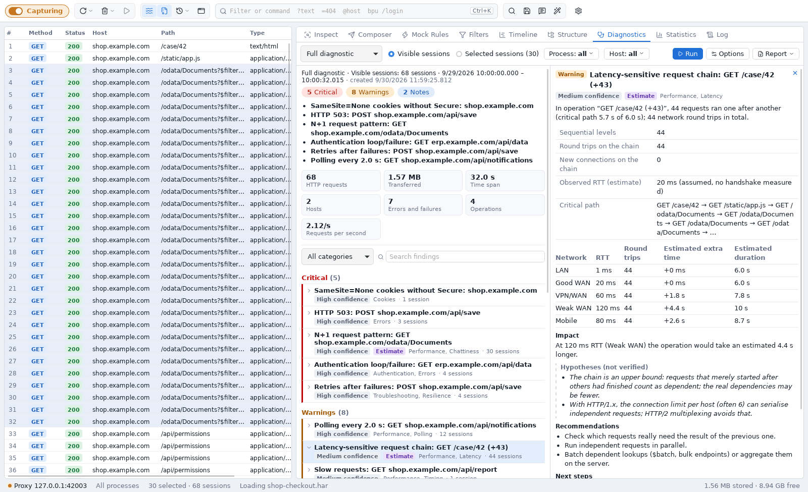

# Diagnostics

A capture of a few minutes easily holds thousands of sessions. *Diagnostics* turns them into
a short list of **findings**: what is conspicuous, why it matters, and where to look next —
each finding with its evidence, so you can check it in the session list with one click.

Open it with **View → Diagnostics** (or the stethoscope tab in the right pane) and press
**Run**. The analysis runs locally in the bundled *webdiag* plugin; nothing leaves your
machine.

## Choose what to analyse

System-wide capture records everything — the browser, a chat client, an updater. Mixed
traffic dilutes the results, so narrow the scope to the application under test:

| Scope | Use it for |
|---|---|
| **Visible sessions** | the session list as filtered (filters, *Hide in List*, process filter) |
| **Selected sessions** | one user action: select its sessions (e.g. in *Timeline* or *Structure*) |
| **Process: …** | only the traffic of one or more processes |
| **Host: …** | only the traffic to target hosts; `*.example.com` includes subdomains |

When the analysed traffic still comes from several applications, the report says so
(*Mixed traffic: results may be diluted*) and offers to narrow the scope to one process.

## Profiles

| Profile | Focus |
|---|---|
| Full diagnostic | all checks |
| Performance | latency, slow and large requests, sequential chains, duplicates, polling, compression, caching |
| Troubleshooting | HTTP errors, connection failures, timeouts, retries, redirects, authentication, TLS, cookies, CORS |
| Authentication | 401/403, repeated authentication, NTLM/Kerberos handshakes, token and cookie problems |
| Network resilience | how the traffic behaves on slow, high-latency or unstable networks |
| Modernization | patterns not to carry over: chatty APIs, polling, large payloads, sequential calls, missing caching |

**Options** sets the thresholds (slow request, server time, large response, the pause that
separates operations) and the network profiles used for estimates (RTT, bandwidth, packet
loss). Every finding names the threshold it was measured against.

## Reading the report

* **Summary** — critical findings, warnings and notes; the most important titles; key
  figures of the analysed traffic.
* **Findings** — grouped by severity and ordered by impact. Each has an *observation*
  (what was measured), *facts*, the *impact*, *hypotheses* (possible causes — not proven),
  *recommendations* and *next steps*. **Estimate** marks modelled statements (for example the
  extra time on a 120 ms network); **confidence** tells how complete the data was — imported
  HAR files have fewer timers than live captures.
* **Select n sessions** marks the affected sessions in the list; **Inspect first** opens the
  first one.
* **Operations** — sessions that belong together (split at pauses and joined by trace ids).
  Recurring background requests such as polling form one *Background* operation.

### What is checked

| Area | Examples |
|---|---|
| Timing | slow requests, high server time (TTFB) vs. transfer time |
| Size | large requests and responses, missing compression (with the estimated saving) |
| Redundancy | exact duplicates, the same request under different URLs (parameter order, OData formatting, cache busters), redundant refreshes, double submits of POSTs |
| Patterns | N+1 (many requests of one shape that differ in one id), polling, retries and retry storms (incl. `Retry-After`), chatty operations |
| OData | unbounded collection queries without `$top`, missing `$select`, deep `$expand`, redundant paging |
| Network sensitivity | the sequential chain of an operation and its extra time per network profile; transfer times per bandwidth (packet loss included) |
| Errors | HTTP errors per endpoint, connection failures by cause (DNS, TLS, refused, timeout, reset) |
| Authentication | failing challenges and loops, repeated NTLM/Negotiate handshakes, uncached tokens |
| OAuth 2.0 / OpenID Connect | errors of Microsoft Entra ID (AADSTS codes), Keycloak, Okta, Auth0, Amazon Cognito, Google, AD FS, Duende IdentityServer, PingFederate and any standard IdP — with the cause and where the admin fixes it (e.g. *App registrations → Authentication → Redirect URIs*, *Clients → Valid redirect URIs*); expired or not-yet-valid tokens (clock skew), wrong audience, missing scopes or roles (`insufficient_scope`), sign-in loops (lost correlation/nonce cookies, `SameSite`), failing silent renewal (third-party cookies), tokens in URLs, oversized tokens and cookies, frequent token refreshes, missing PKCE, implicit flow, password grant and `client_secret` in the browser, discovery documents fetched again and again or with a mismatching issuer |
| HTTP | redirect chains and loops, cookie flags (`Secure`, `SameSite`, `HttpOnly`), caching headers, connection reuse, old TLS versions, CORS preflights |
| Character encoding | declared charset that does not match the bytes (“Grüße” → “Gr��e” or “Grüße”), header, BOM and document declaration that disagree, text without any charset, double-encoded UTF-8, characters already lost (`�`), JSON not in UTF-8, unknown charset names, compressed data without (or with a broken) `Content-Encoding` |
| Clocks | servers whose clock differs from this computer (Kerberos tolerates 5 minutes, token libraries often 60 s), this computer's own clock being off (several unrelated sites agree), servers behind one name with different clocks |

!!! note "Latency estimates"
    The sequential chain is an upper bound: requests that only happened to start after
    others count as dependent. Treat the estimate as a hypothesis and verify it with the
    bandwidth/latency simulation (*Settings → Connections*).

!!! tip "In CI"
    The same analysis runs in build pipelines and fails the build on regressions — see
    [Diagnostics in CI](ci.md).

## Save, share and compare

**Report ▾** saves the report as JSON (complete, for comparison later) or Markdown, and
**Copy for AI** puts a Markdown version with a short instruction on the clipboard, to ask an
AI assistant for an explanation of causes and priorities.

**Compare with saved report…** opens an earlier JSON report (for example of the previous
version of your application): key figures before → after, and findings that are new,
resolved or changed in severity.

## Privacy

The plugin sees only what it needs: selected headers, sizes, timers and fingerprints of the
bodies — never the bodies themselves. Credentials are replaced by their size before the data
reaches the plugin:

* `Authorization`, `Proxy-Authorization`: only the scheme remains (`Bearer <812 bytes>`);
  cookie values are removed (`Cookie` keeps the names, `Set-Cookie` the attributes).
* In URLs and in `Location` and `Referer`: user names and passwords, query parameters that
  carry tokens, codes, signatures, keys or passwords (`access_token`, `code`, `sig`,
  `X-Amz-Signature` …) and every other query value longer than 64 bytes.

For authentication the host passes facts, not tokens: the non-secret claims of JWTs (issuer,
audience, client, scopes and roles, times — no signature, no names or e-mail addresses), the
OAuth parameters of authorization and token requests (`client_id`, `response_type`, `scope`,
`prompt`, the `redirect_uri` without its query; `code`, `state`, `nonce`, PKCE values and
secrets only as “present”), the `error` and `error_description` of OAuth error responses (e-mail addresses masked) and
the endpoints of discovery documents.

URL paths, host names and OData query options are kept, so reports, Markdown and AI exports
still contain them — check exports before you share them.
