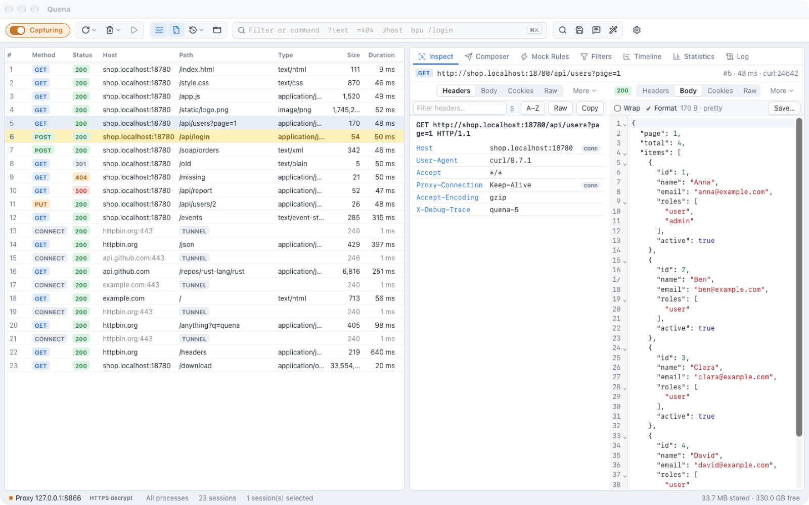
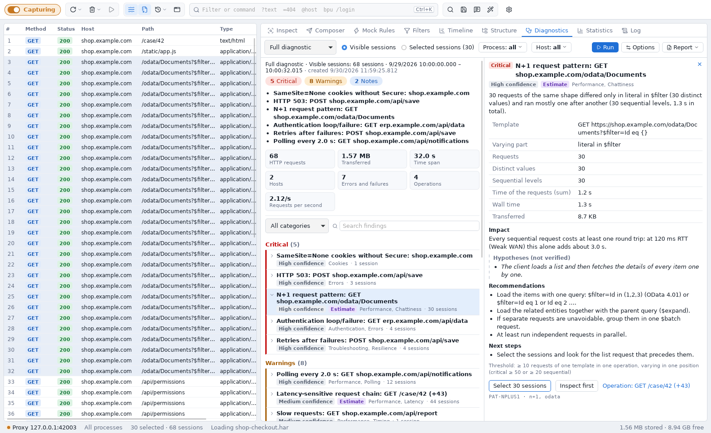

# Quena

**Quena** is a local HTTP(S) debugging proxy for macOS, Windows and Linux. It records the
traffic between your applications and the servers they talk to, and lets you inspect,
change, replay and mock it — **and it diagnoses it.**

## Diagnostics: from thousands of sessions to what matters

A capture of a few minutes easily holds thousands of sessions. **Diagnostics** does the first
pass for you: it turns them into a short, prioritised list of findings — N+1 queries,
redundant calls, retry storms, authentication loops, missing compression and caching,
request chains that get slow on VPN or mobile networks — and answers for each one *what is
conspicuous, why it matters and where to look next*, with the evidence one click away.

[Read more about Diagnostics →](diagnostics.md){ .md-button .md-button--primary }

## What you can do with it

- **Capture** HTTP/1.1, HTTP/2 and HTTPS (with a locally generated root certificate),
  CONNECT tunnels, WebSocket frames and Server-Sent Events — from this computer, from
  phones and tablets, or from VMs.
- **Inspect** headers, bodies, cookies, caching and authentication, with views that pick
  themselves for the content: JSON, XML, SOAP, Atom/OData, gRPC, multipart/MTOM,
  WebSocket, SSE, images and more. Multi-gigabyte bodies open instantly.
- **Change and replay**: breakpoints and tampering, Mock Rules (including Map Remote and
  Map Local), a Composer with cURL import, and replay in several variants.
- **Diagnose**: prioritised findings with evidence, profiles for performance, troubleshooting,
  authentication, network resilience and modernization, estimates for slow networks, and
  comparison of two captures — see [Diagnostics](diagnostics.md).
- **Analyze**: statistics, a timing waterfall, a host/path tree, comparing two sessions,
  and Text Tools for quick encoding and decoding.
- **Automate**: JavaScript rules scripts, WebAssembly plugins, automatic authentication
  (NTLM, Negotiate/Kerberos, Basic), client certificates, bandwidth simulation.
- **Share**: save and load `.saz` and `.har` archives, copy requests as cURL, fetch,
  PowerShell or Python.

## Local and private

Quena runs entirely on your machine. There is no account, no cloud service and no
telemetry. The root certificate is generated locally and trusted only when you ask for it,
HTTPS decryption is opt-in, and saved passwords live in the operating system's secure store
(Keychain, Windows Credential Manager or Secret Service).

## How this manual is organized

| If you want to … | Read |
|---|---|
| install Quena and record your first request | [Install and first start](install.md) |
| capture from browsers, CLI tools, phones or through a corporate proxy | [Capturing traffic](capture.md), [HTTPS and devices](https.md) |
| find, sort, mark and filter sessions | [Session list](sessions.md) |
| read requests and responses | [Inspect](inspect.md) |
| change, mock or resend traffic | [Change and replay](change-replay.md) |
| find out what is wrong with the traffic | [Diagnostics](diagnostics.md) |
| look at timing, volumes and structure | [Analyze](analyze.md) |
| exchange captures with colleagues | [Archives and copying](archives.md) |
| automate with scripts or plugins | [Rules scripts](scripting.md), [Plugins](plugins.md) |
| look up a setting, shortcut or command | [Reference](settings.md) |

!!! note "Early preview"
    Quena is at version `0.x`. Settings, file formats and the plugin API may still change
    between releases. See the
    [changelog](https://github.com/hkiam/quena/blob/main/CHANGELOG.md) for what is new.

Quena is open source under the Apache License 2.0. Source code, releases and issue tracker:
[github.com/hkiam/quena](https://github.com/hkiam/quena).
