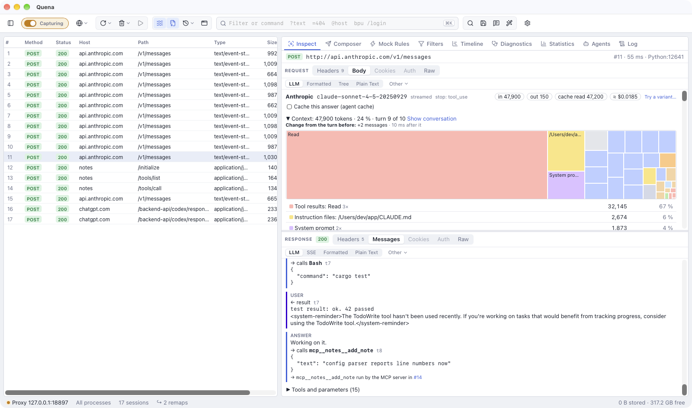

# LLM traffic

Applications that use large language models talk to their APIs over HTTPS like any other
client. Quena recognises these calls and shows them as what they are: a request to a model,
its tools, the answer and what it cost, also when the answer came as a stream. How the calls
of one agent run fit together is on [Agent conversations](agents.md).

## What is recognised

| API | Recognised by |
|---|---|
| OpenAI Chat Completions and every OpenAI-compatible API (Azure OpenAI, Mistral, Groq, OpenRouter, DeepSeek, xAI, Together, Fireworks, LM Studio, vLLM, LiteLLM …) | `POST …/chat/completions` |
| OpenAI Responses | `POST …/responses`, and over a WebSocket to `…/responses` (Codex): see below |
| Anthropic Messages | `POST …/v1/messages` |
| Google Gemini and Vertex AI | `POST …:generateContent`, `…:streamGenerateContent` |
| Ollama | `POST …/api/chat`, `…/api/generate` |
| Embeddings | `POST …/embeddings`, `…/api/embed`, `…/api/embeddings`, `…:embedContent`, `…:batchEmbedContents` |
| Claude on Google Vertex AI | `POST …/publishers/anthropic/models/…:rawPredict`, `…:streamRawPredict` (Anthropic's format) |
| Claude on Amazon Bedrock | `POST bedrock-runtime…/model/…anthropic.…/invoke`, `…/invoke-with-response-stream` (Anthropic's format, streamed in AWS's event stream) |
| Amazon Bedrock Converse (any model) | `POST bedrock-runtime…/model/…/converse`, `…/converse-stream` |

**Over a WebSocket.** Codex sends its calls over a WebSocket to `…/responses` (OpenAI's
Responses API with `responses_websockets`): each `response.create` it sends, with the events
the server answers up to `response.completed`, becomes a session of its own next to the
WebSocket, a `POST` with the request as body and the events as a stream (comment *Over
WebSocket #12 (call 3)*, flag `x-quena-ws-call`). They are made while the WebSocket is open,
so the LLM view, conversations and costs work as for calls over HTTP. Messages compressed with
`permessage-deflate` are read inflated.

**Threads and stored responses.** A call that continues a server-side thread carries only
what is new: Claude Code's message threads (`thread` with `previous_message_id`) and OpenAI's
`previous_response_id`. Quena links it to the call whose answer it names and puts the whole
history together from the calls before it for hints and the context map.

A request counts only when its JSON body carries what that API needs (`messages`,
`contents`, `input` …), so another application's `/api/chat` is not taken for Ollama. HTTPS
decryption must be on, as for any HTTPS content.

The provider is named by the API's host (`OpenAI`, `Azure OpenAI`, `Anthropic`, `Google
Gemini`, `Google Vertex AI`, `Amazon Bedrock`, `Mistral`, `Groq`, `OpenRouter` …); other hosts,
such as a company gateway or a local server, keep their host name (Ollama's APIs are named
`Ollama`). Models named in the URL (Gemini, Vertex AI, Bedrock, e.g.
`us.anthropic.claude-sonnet-4-5-20250929-v1:0`) are taken from there and priced like the
provider's own model.

!!! note "Amazon Bedrock and AWS Signature V4"
    Bedrock requests are signed with AWS Signature V4 (`Authorization: AWS4-HMAC-SHA256 …`,
    or `X-Amz-Signature=` in a presigned URL). The signature covers the body, so AWS refuses
    any changed copy with `403`. Quena therefore leaves signed requests alone in its LLM
    rewrite operations, and the prompt playground refuses them. Edits at a breakpoint,
    generic JSON rewrite rules and replays with a changed body still break the signature.
    Errors in AWS's event stream (exception frames) and Bedrock's `{"message": …}` errors show
    as the call's error.

## The LLM view



Selecting such a session opens the **LLM** view (on both the request and the response
side):

- a header with provider, model, whether the answer was streamed, the stop reason
  (`stop`, `end_turn`, `tool_calls`, `max_tokens` …), the **token usage** (input, output,
  read from and written to the provider's cache, reasoning) and the **estimated cost**;
- the **system prompt** (also `instructions`, `systemInstruction`), without Claude Code's
  attribution block (`x-anthropic-billing-header: …`), which changes with every request;
- the **messages** sent, by role: text, images as placeholders, **tool calls** with their
  arguments and **tool results** with the call they answer;
- the **answer**: text, thinking or reasoning summaries (collapsed), tool calls. Streams
  (server-sent events, Ollama's JSON lines, Gemini's array, AWS's event stream) are put
  together;
- **tools and parameters**: the tool definitions offered and the parameters sent
  (`temperature`, `max_tokens`, `reasoning_effort`, `thinking` …);
- under the answer, the **MCP exchanges** that ran its tool calls (see
  [Tool call trail](mcp-traffic.md#tool-call-trail));
- **Context**: the call's turn in its conversation (*Show conversation* opens the Agents
  panel), the map of what fills its input, the change from the call it continues and the
  provider's cache verdict, described on
  [Agent conversations](agents.md#the-context-section-of-the-llm-view).

An error the API answered with (rate limit, invalid request) is shown at the top. Texts
longer than 200,000 characters are shortened in this view; the body views show them
whole. A stream that ended early says so.

From the view, *Cache this answer* puts a successful answer into the
[agent cache](optimize-agents.md#agent-cache), and *Try a variant…* sends the call again
with changes ([Try a variant](optimize-agents.md#try-a-variant)).

## In the session list

When a call is done, it gets the flags `x-quena-llm` (`provider/model`),
`x-quena-llm-tokens`, `x-quena-llm-usage` and `x-quena-llm-cost`. LLM and MCP requests also
get `x-quena-agent`, the agent or SDK that sent them, read from the User-Agent
(`Claude Code 2.0.14`, `Codex 0.46.0`, `Gemini CLI`, `Cursor`, `GitHub Copilot`,
`OpenAI SDK (Python)` …; for clients Quena does not know, the first word of the User-Agent,
such as `my-app/1.2`). The flags
are kept in `.saz` archives. LLM calls in archives from other tools (without Quena's flags)
get them when the Agents panel opens.

- Columns **LLM**, **Tokens**, **Cost** and **Agent** (right-click the column headers); they
  sort. The column **Conversation** is described on
  [Agent conversations](agents.md#columns-grouping-and-filters).
- *Group by → LLM model* puts the calls of each model together, *Group by → Agent (Claude
  Code, Codex …)* those of each agent.
- Filters: `llm ~ claude`, `llm == "OpenAI/gpt-4o"`, `tokens > 10000`,
  `agent ~ "claude code"` (see [syntax](syntax.md#filter-expressions)).
- *Statistics* lists calls, tokens and estimated cost per model for the selection.

## Costs

The cost is an estimate: tokens times the model's list price. Input read from the provider's
cache is charged at the cached price, input written to it at the cache-write price, and the
rest at the input price. Discounts and batch prices are not known, and models without a price
show *cost unknown*. Answers from Quena's agent cache cost nothing and are not added up.
Prices come from three places, and the first that knows the model wins
(*Settings → Bodies & Storage → LLM prices* shows all three):

1. **Your own prices** in `llm-prices.json` in the [data directory](settings.md#data-directory)
   (*Create llm-prices.json* / *Edit llm-prices.json* opens it). US dollars per million
   tokens, by model name prefix (the longest prefix wins). `cacheRead` and `cacheWrite`
   default to the input price; `context`, the model's context window in tokens, is optional:

    ```json
    {
      "gpt-5.1": { "input": 1.25, "output": 10, "cacheRead": 0.125 },
      "claude-opus-4-5": { "input": 5, "output": 25, "cacheRead": 0.5, "cacheWrite": 6.25 },
      "my-model": { "input": 0.5, "output": 1.5, "context": 128000 },
      "llama": { "input": 0, "output": 0 }
    }
    ```

    Changes count from the next call on, without a restart. A file that is not valid JSON is
    reported in the settings, the log and the *LLM* view; its prices are not used until it
    is fixed.

2. **The fetched price list**: *Fetch prices* / *Update prices* downloads
   [LiteLLM's price list](https://github.com/BerriAI/litellm/blob/main/model_prices_and_context_window.json)
   (MIT licence, several hundred models of OpenAI, Anthropic, Google, Mistral, DeepSeek,
   Groq, Bedrock, Azure …) through Quena's [upstream settings](settings.md) and keeps it in
   `llm-prices-litellm.json` in the data directory. This is the only time Quena asks for
   prices, and only when clicked; *Remove list* goes back to the other two. A model matches
   by its name with a date or release tag at most (`gpt-4o-2024-08-06` → `gpt-4o`).

3. **Built-in list prices** of common OpenAI, Anthropic, Google, Mistral and DeepSeek models
   as published in 2025, matched like the fetched list (a newer `claude-opus-4-7` does not
   get the price of `claude-opus-4`).

Model names are compared without a provider path (`openai/gpt-4o`) and without Bedrock's
region, vendor and version (`us.anthropic.claude-sonnet-4-5-20250929-v1:0` →
`claude-sonnet-4-5-20250929`).

## Replay answers without calling the model

To test an application without paying for (or waiting on) the model, answer its calls from
recorded sessions: select them and use *Mock Rules → Mocks from Sessions…* (see
[mocks from a capture](mocks.md)). With *Match request bodies* each prompt gets its own
recorded answer (JSON compared regardless of key order); without it, *In recorded order*
answers the calls one after the other. Streamed answers are replayed as recorded.

To answer an agent's repeated calls automatically, or to run an agent again against a
recorded run, use the [agent cache](optimize-agents.md#agent-cache) and
[Freeze a run for replays](optimize-agents.md#freeze-a-run-for-replays).

## For AI agents

Over [Quena's MCP server](mcp.md), `get_llm_call` returns a call taken apart the same way;
the session rows carry `llm` and `tokens`. Unless agents may see secrets, the bodies are
redacted first (credentials and secret fields), as for `get_session`. The tools for
conversations are listed on [Agent conversations](agents.md#for-ai-agents).
