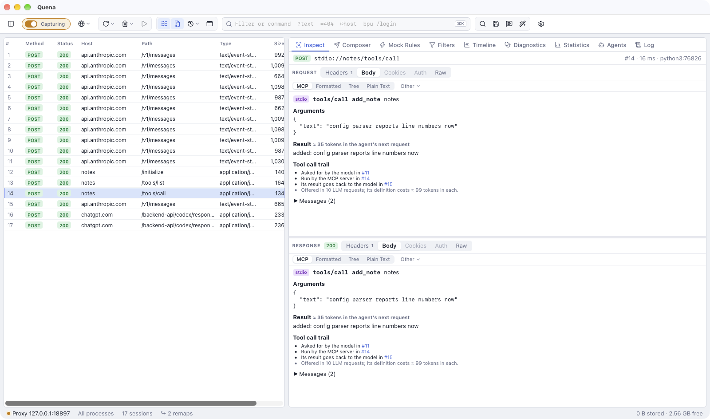
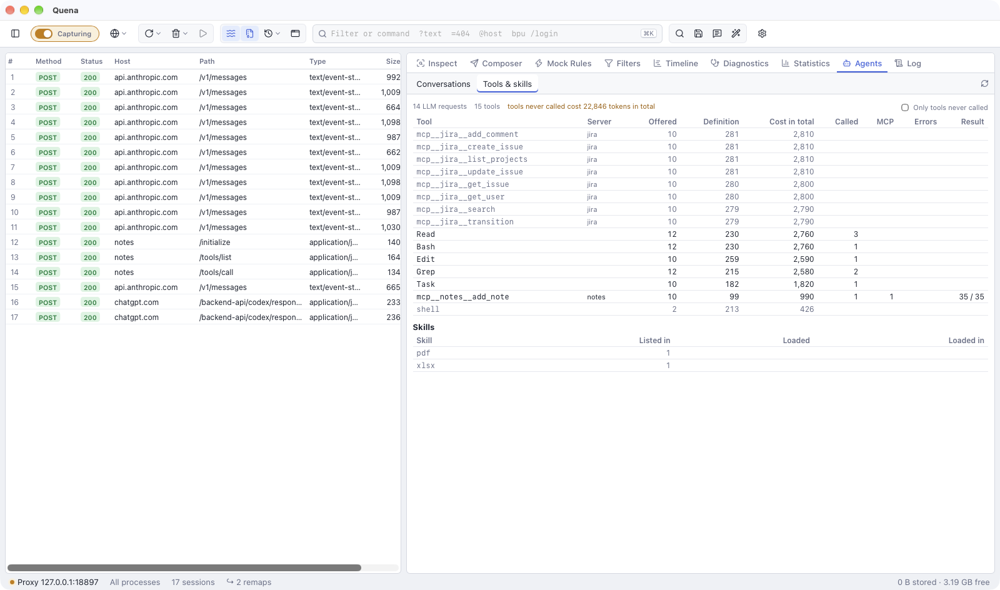

# MCP servers and skills

Agents call their tools on MCP servers (Model Context Protocol). Quena records these
exchanges, shows each tool call with its arguments and result, and traces it from the model's
answer that asked for it to the request that carried the result back. It also sums up which
tools and skills the agents offered and used. This page is about MCP traffic; the MCP server
Quena itself offers to agents is on [Quena's MCP server](mcp.md).

## What is recognised

Quena takes apart JSON-RPC 2.0 with the methods of the protocol (`initialize`, `tools/list`,
`tools/call`, `resources/…`, `prompts/…`, `notifications/…` …) over these transports:

- **Streamable HTTP**: a POST answered with JSON or with a stream of server-sent events;
  batches (several requests in one POST) are shown with the first request and how many more
  (`tools/call a +1`);
- the **older SSE transport**: a GET stream that announces an endpoint (`event: endpoint`),
  and POSTs to it. The server answers such a POST with `202` and sends the result on the
  stream; Quena takes it from there. The stream stays open for the whole run and is marked
  when it closes;
- **stdio**, recorded by `quena-cli mcp-tap` (see
  [Servers that talk over stdio](#servers-that-talk-over-stdio)).

Which HTTP sessions are looked at is decided by what is cheap to see; the body must then be
JSON-RPC with an MCP method. A session is looked at when:

- the request or the response has an `Mcp-Session-Id` or `MCP-Protocol-Version` header; or
- it is a POST whose `Accept` header names both `application/json` and `text/event-stream`,
  as MCP clients must send; or
- it is a GET or POST to a host starting with `mcp.`, or to a path ending in `/mcp`, `/sse`,
  `/messages` or `/message`, or containing `/mcp/`.

An MCP server on another path whose client sends none of these headers is not recognised.
Calls to LLM APIs are never taken for MCP. HTTPS decryption must be on, as for any HTTPS
content.

## The MCP view



Selecting an MCP exchange opens the **MCP** view (when the exchange carries MCP headers or
comes from `mcp-tap`; otherwise pick *MCP* from the views):

- the method (`initialize`, `tools/list`, `tools/call`, `resources/read` …), the server's
  name and version, the protocol version and the MCP session id;
- for `tools/call`: the tool, its **arguments**, the **result** (text, images, audio,
  resources, structured content), whether it failed (a JSON-RPC error or `isError`), and
  about how many tokens the result adds to the agent's next request;
- the [tool call trail](#tool-call-trail);
- for `tools/list`: the tools offered with the tokens each definition costs, and what they
  cost together in every LLM request that offers them all;
- all JSON-RPC messages sent and received.

Texts longer than 100,000 characters are shortened in this view; the body views show them
whole.

## Tool call trail

For a `tools/call`, the MCP view shows the *Tool call trail*:

1. **Asked for by the model in**: the LLM call whose answer asked for the tool. Quena looks
   for the latest LLM call that started up to 10 minutes before the exchange and whose answer
   called this tool of this server, preferring one of the same client process (several
   agents may call the same tools at once).
2. **Run by the MCP server in**: this exchange.
3. **Its result goes back to the model in**: the next call of that conversation, which
   carries the result to the model.

It also says in how many LLM requests the tool is offered and what its definition costs in
each.

The other way round, the [LLM view](llm.md#the-llm-view) lists under the answer the MCP
exchanges that ran its tool calls: for each tool call, the first exchange of that server's
tool after the answer and before the conversation's next turn (or within 10 minutes), of the
same client process first.

Tools are matched by name and server. Claude Code names MCP tools `mcp__server__tool`
(`mcp__jira__get_issue`); that is matched with the tool `get_issue` of a server whose name
(from `initialize`, else its host) fits `jira`. Names are compared without case, punctuation
and words like `mcp` or `server`, so `claude_ai_Jira`, `Jira MCP` and `mcp.jira.example` all
fit.

## Columns, grouping and filters

Exchanges get the flags `x-quena-mcp` (the method and tool, e.g. `tools/call get_issue`) and
`x-quena-mcp-server` (the name from `initialize`, else the host; for `mcp-tap` the name given
with `--name`), and `x-quena-agent`, the agent from the User-Agent (as for [LLM calls](llm.md#in-the-session-list)):

- columns **MCP** and **MCP server**;
- *Group by → MCP server*;
- filters `mcp ~ "tools/call"` and `mcpserver == jira` (see
  [syntax](syntax.md#filter-expressions)).

Archives from other tools get these flags when you open *Tools & skills* or a tool call's
trail.

## Servers that talk over stdio

Most MCP servers run as a local process and talk over stdin and stdout; no proxy sees that.
Put `quena-cli mcp-tap` in front of the server's command in the MCP client's configuration.

### Install quena-cli

`quena-cli` is a download of its own, next to the app (see [quena-cli](install.md#quena-cli)).
Give its **full path** in the configuration: apps started from the dock or the start menu do
not see your shell's `PATH`.

### Configure the MCP client

The pattern is always the same: the client runs `quena-cli`, and everything after `--` is the
server's own command.

```sh
/full/path/quena-cli mcp-tap --name NAME -- <the server's command and arguments>
```

=== "Claude Code"

    ```sh
    claude mcp add jira -- /usr/local/bin/quena-cli mcp-tap --name jira -- npx -y jira-mcp-server
    ```

    For a server you have already added, remove it first (`claude mcp remove jira`) or edit
    its `command` and `args` in the configuration file.

=== "Codex"

    In `~/.codex/config.toml`:

    ```toml
    [mcp_servers.jira]
    command = "/usr/local/bin/quena-cli"
    args = ["mcp-tap", "--name", "jira", "--", "npx", "-y", "jira-mcp-server"]
    ```

=== "VS Code"

    In `.vscode/mcp.json` of the workspace (or the user `mcp.json`):

    ```json
    {
      "servers": {
        "jira": {
          "type": "stdio",
          "command": "/usr/local/bin/quena-cli",
          "args": ["mcp-tap", "--name", "jira", "--", "npx", "-y", "jira-mcp-server"]
        }
      }
    }
    ```

=== "Cursor, Claude Desktop and others"

    In `~/.cursor/mcp.json` (or the client's own file with `mcpServers`):

    ```json
    {
      "mcpServers": {
        "jira": {
          "command": "/usr/local/bin/quena-cli",
          "args": ["mcp-tap", "--name", "jira", "--", "npx", "-y", "jira-mcp-server"]
        }
      }
    }
    ```

On Windows, use the path of `quena-cli.exe`; commands like `npx` or `uvx` that are `.cmd`
files are run through `cmd.exe`.

### What is recorded

`mcp-tap` runs the server and passes everything through unchanged. It pairs the requests with
their responses and appends each exchange to `mcp-tap/<name>-<pid>.jsonl` in Quena's data
folder. The files are readable only by your user (`0600`): they hold tool arguments and
results.

While Quena captures, it reads the folder every second and shows the exchanges as sessions
`stdio://jira/tools/call`, with the server's process and the name given with `--name` as MCP
server. Requests of the server to the client (sampling, roots, elicitation) appear as
`stdio://jira/server/…`. Requests never answered (the server ended, the client cancelled)
appear without a response. Exchanges recorded while Quena does not capture wait in the folder
and appear when it captures again.

### Portable app and data folder

`mcp-tap` finds the data folder as the app does: `QUENA_DATA_DIR`, else the portable folder,
else your user's data folder. When the app runs portable or with `QUENA_DATA_DIR` and
`quena-cli` does not see the same, add `--data-dir "<the app's data folder>"` before `--`
(*About Quena* shows the folder).

### Signals and exit codes

A signal to `mcp-tap` (Ctrl-C, SIGTERM, SIGHUP, the client ending the server) is passed on:
the server gets SIGTERM and five seconds to end, then it is killed. `mcp-tap` exits with the
server's exit code (128 plus the signal number when the server was ended by a signal), or `2`
when its own arguments are wrong or the server cannot be started.

### Limits

- When the data folder cannot be written, the server still runs, without recording.
- A recording file stops growing at 1 GB: later exchanges are not recorded, the server keeps
  running.
- A message larger than 32 MB is passed through but not recorded.
- Up to 10,000 requests can wait for their answer; beyond that the oldest are recorded
  without one.
- The app reads at most 4 MB of recordings per second; the rest follows in the next seconds.
- Recordings read completely are removed after 7 days without new exchanges.

## Tools and skills



*Agents → Tools & skills* sums up the tools and skills of all conversations in the capture:

- every **tool**, most expensive first (its definition's tokens times the requests that offer
  it): the server, the LLM requests that offer it, what its definition costs in each and in
  total, how often the model called it, the exchanges with its MCP server, the failures
  (an error or `isError`), and the average and largest result in tokens of the calls that did
  not fail. Tools that are offered but never called are shown muted; *Only tools never
  called* lists them alone, with what they cost in total. MCP tools named the way Claude Code
  names them (`mcp__jira__get_issue`) are matched with the server's `get_issue`;
- every **skill**: in how many conversations it is listed, how often the model loaded it
  (Claude Code's Skill tool, or reading its `SKILL.md` with a file tool or `cat`, `sed`,
  `head`, `less`), and in how many conversations. Plugin skills keep their scope
  (`anthropic-skills:docx`).

## For AI agents

Over [Quena's MCP server](mcp.md), `get_tool_report` returns the same report of tools and
skills, and the session rows carry the MCP flags.
