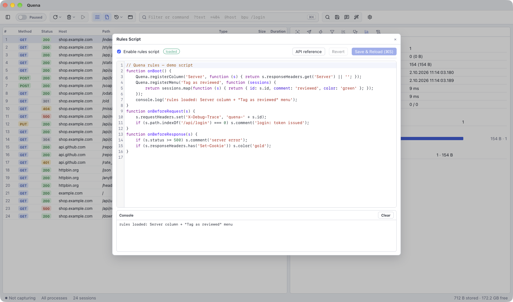

# Rules scripts

A **rules script** is a JavaScript file with functions Quena calls for every request and
response. Use it for anything Mock Rules cannot express: rewrite headers, answer or redirect
requests by your own logic, colour and comment sessions, add a custom column or your own
commands to the context menu.



## The editor

Open **Capture → Rules Script…** (`Ctrl/⌘ R`).

- **Enable rules script** switches the script on or off; the state next to it says
  *loaded*, *not loaded* or *error*.
- Edit the script and press **Save & Reload** (`Ctrl/⌘ S`). The script is reloaded
  instantly; compile errors appear above the editor.
- **API reference** shows the complete type definitions next to the editor. The editor
  also uses them for completion.
- **Revert** discards unsaved changes.
- The **Console** at the bottom shows the script's `console.log()` output; *Clear* empties
  it.

The script is saved as `rules.js` in the [data directory](settings.md#data-directory);
whether it is enabled is remembered across restarts.

## Hooks

Define any of these top-level functions — each is optional:

```js
function onBoot() {}                    // once, when the script loads
function onBeforeRequest(session) {}    // before a request is forwarded
function onBeforeResponse(session) {}   // before a response returns to the client
function onSessionComplete(summary) {}  // after a session finished (id, method, url, status)
function onWebSocketMessage(msg) {}     // each WebSocket message on its way
```

### WebSocket messages

`onWebSocketMessage(msg)` sees every whole WebSocket message of up to 1 MB in both
directions and can change or drop it:

```js
function onWebSocketMessage(msg) {
  // msg.id, msg.url (of the upgrade request), msg.direction ("up": client → server,
  // "down": server → client), msg.isBinary, msg.size, msg.text (text messages)
  if (msg.direction === 'down' && msg.text && msg.text.indexOf('"price"') >= 0) {
    msg.text = msg.text.replace(/"price":\s*\d+/, '"price": 0');
  }
  if (msg.direction === 'up' && msg.text === '2') msg.drop();   // swallow Engine.IO pings
}
```

Assigning `msg.text` sends that text instead; `msg.drop()` does not send the message at all.
Binary messages can be dropped but not changed. Fragmented messages and messages compressed
with `permessage-deflate` pass unchanged. The WebSocket view marks changed messages with ✎
and dropped ones with ✕ (showing what arrived). WebSockets are only routed through the
script while it defines this hook.

## The session object

| Member | Phase | Meaning |
|---|---|---|
| `id`, `process`, `clientIp`, `phase` | both | read-only information |
| `url` | both | full URL; assign in the request phase to send the request elsewhere |
| `method`, `host`, `path`, `requestHeaders` | request | the request |
| `status`, `reason`, `responseHeaders` | response | the response |
| `comment(text)` | both | set the comment (Comments column) |
| `color(name)` | both | mark the row: `red`, `blue`, `gold`, `green`, `orange`, `purple` |
| `custom(value)` | both | value for the Custom column |
| `flag(key, value)` | both | attach a session flag |
| `redirect(url)` | request | send the request to another URL |
| `abort()` | both | drop the connection / cut the response |
| `respond(status, body, headers)` | request | answer locally without contacting the server |

Headers are ordered and case-insensitive: `get`, `getAll`, `has`, `set` (replaces
duplicates), `add`, `remove`, `names`, `toArray`. `comment`, `color`, `custom` and `flag`
return the session, so they can be chained.

## Custom column and menu commands

In `onBoot`, the `Quena` object extends the UI:

- `Quena.registerColumn(title, fn?)` — defines the **Custom** column (show it by
  right-clicking the column headings). Its value comes from `session.custom()` or from
  `fn(session)` at response time.
- `Quena.registerMenu(label, handler)` — adds a command to the session context menu under
  **Scripts**. The handler gets the selected sessions (`id`, `method`, `url`, `status`,
  `host`, `process`, `comment`, `contentType`) and may return updates
  `{ id, comment?, color?, custom? }` to apply.

## Example

```js
function onBoot() {
    // A "Custom" column filled from each response
    Quena.registerColumn('Server', s => s.responseHeaders.get('Server') || '');

    // A command in the session context menu (right click → Scripts)
    Quena.registerMenu('Tag as reviewed', sessions =>
        sessions.map(s => ({ id: s.id, comment: 'reviewed', color: 'green' })));
}

function onBeforeRequest(s) {
    s.requestHeaders.set('X-Debug-Trace', 'quena-' + s.id);
    if (s.host === 'ads.example.com') s.abort();
    if (s.path === '/api/feature-flags') s.respond(200, '{"newCheckout":true}',
                                                   { 'Content-Type': 'application/json' });
}

function onBeforeResponse(s) {
    if (s.status >= 500) s.color('red').comment('server error');
    s.responseHeaders.remove('Strict-Transport-Security');
}
```

## Limits

Scripts are sandboxed (QuickJS) and cannot slow the proxy down:

- no file-system, network or environment access — only `console` and the session;
- **headers and metadata only**: bodies never enter the script and keep streaming, so
  enabling a script never turns a 5 GB download into a 5 GB buffer. The exception are
  WebSocket messages up to 1 MB for `onWebSocketMessage`;
- a time budget of 250 ms per hook (2 s for loading and `onBoot`) and 64 MB of memory; an
  endless loop is interrupted;
- a request waits at most **2 s** for its hook. After that it passes through unchanged and
  the late hook is skipped — a slow script degrades to "no rules" instead of stalling
  traffic.

The full API is in
[`quena.d.ts`](https://github.com/hkiam/quena/blob/main/crates/quena-script/src/quena.d.ts).
