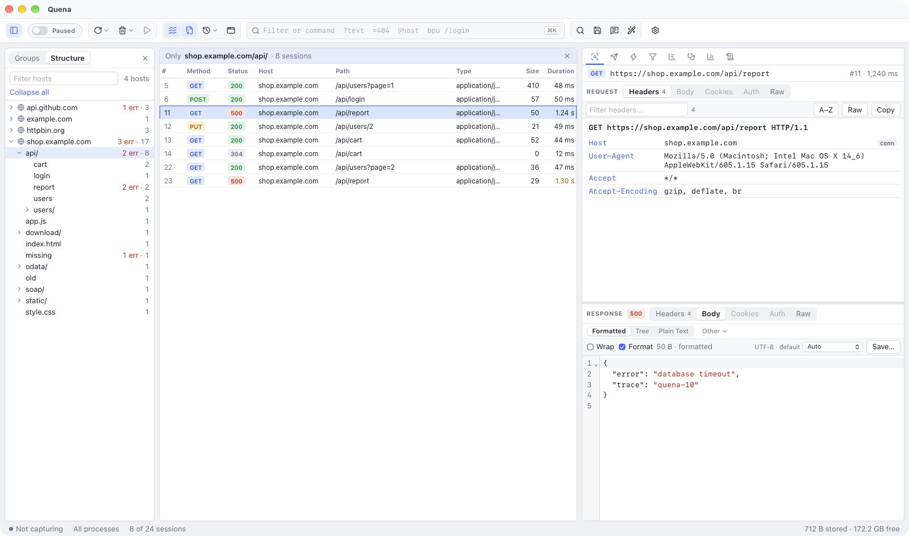

# Session list

Every request Quena records is a **session**: the request, the response (if any), timing,
the client process and your own notes. The list handles hundreds of thousands of sessions.

## Columns

| Column | Shows |
|---|---|
| `#` | Session number, in arrival order. |
| *Method* | HTTP method as a coloured badge. |
| *Status* | Response status as a coloured badge (`ERR` for an aborted session without a status). |
| *Host* | Target host. Tunnels are listed by their target host with a badge. |
| *Path* | Path and query. Takes the width the other columns leave. |
| *Type* | Response `Content-Type`. |
| *Size* | Response body size in bytes. |
| *Duration* | Time from request to complete response. |
| *Process* | The application that sent the request. |
| *Protocol* | Protocol of the session (e.g. `HTTP`, `HTTPS`). |
| *Comments* | Your comment, or one a rule or script added. |
| *Custom* | A value from the [rules script](scripting.md) (`Quena.registerColumn`). |
| *Caching* | Caching-related response headers. |
| *Started* | Time the request started. |
| *Via* | How the request came in besides the proxy port: the [reverse proxy](reverse-proxy.md) entry, `SOCKS5` or `transparent` ([SOCKS and transparent](socks-transparent.md)). |
| *TLS* | TLS version towards the server (else towards the client). |
| *Server IP* | The address the request was sent to. Sorts by number. |
| *HTTP version* | HTTP version of the request (`HTTP/1.1`, `HTTP/2` …). |
| *↑ Name*, *↓ Name* | A request (↑) or response (↓) header as its own column — right-click a header in the *Headers* view → *Add … as a Column* (up to three; sortable). |

The Quena layout shows `#`, Method, Status, Host, Path, Type, Size and Duration; the Classic
layout shows more columns.

- **Sort:** click a column heading (ascending, descending, back to arrival order).
- **Show or hide columns:** right-click the heading row. *Reset Columns* restores the
  layout's defaults.
- **Resize** by dragging the edge of a heading, **reorder** by dragging a heading onto
  another.
- **Filter by a column:** right-click its heading → *Filter by …*. Type a value (contains;
  with `*` a wildcard; numbers: equal) or an operator first (`>= 400`, `!= 200`, `=~ ^/v2`);
  the clause is added to the filter expression. Headings the filter tests show ⏷. A header
  column is removed the same way (*Remove header column*).

## Navigator

The navigator left of the list (off by default) gives an overview and narrows the list to
one part of the traffic. Show it with the ▯ button at the left of the toolbar,
*View → Navigator* or `Ctrl/⌘ Alt N`.



- **Groups** lists the groups of the sessions (see *Grouping* below) — every connection,
  host, process, trace id, session cookie or Custom value — with how many sessions and
  errors each has. The choice of *Group by* is the list's own, so the list shows the same
  groups.
- **Structure** shows hosts and paths as a tree (see [Analyze](analyze.md#structure)). It
  is what the navigator opens with while the list is not grouped.
- **Click an entry to show only its sessions** in the list. A bar above the list says what
  it shows; ✕ there, *All sessions* or a second click on the entry shows everything
  again. The navigator itself always lists everything the filters let through.
- Right-click an entry: *Show Only These Sessions* or *Select These Sessions*.
- Filters apply first, the navigator narrows further. Hiding the navigator or loading
  another archive shows all sessions again.

## Grouping

*Group by* (right-click the heading row, or the command palette) keeps sessions that
belong together in one block:

| Group by | Sessions that share |
|---|---|
| *Connection (keep-alive)* | the client connection: requests a browser sent over one keep-alive or HTTP/2 connection |
| *Host* | the target host |
| *Process* | the client application |
| *Trace / correlation id* | the trace id (`traceparent`, B3, `uber-trace-id`, `X-Amzn-Trace-Id`, `X-Cloud-Trace-Context`) or a correlation header (`X-Correlation-ID` …) — one user action across connections |
| *Session cookie* | the session cookie (`JSESSIONID`, `PHPSESSID`, `ASP.NET_SessionId`, `connect.sid`, `sessionid` …) — one login |
| *Custom column* | the value a [rules script](scripting.md) puts into *Custom*: your own grouping |
| *Via (reverse proxy, SOCKS, transparent)* | the [reverse proxy](reverse-proxy.md) entry, or the [SOCKS or transparent](socks-transparent.md) port the requests came through |
| *LLM model* | the provider and model of [LLM API calls](llm.md) |
| *Source (live, archives)* | where the session comes from: recorded *live*, or the archive it was loaded from (each [snapshot](archives.md#snapshot-library) apart) |

- Groups appear in the order of their first session; **inside each group the list is
  sorted** by the column you click. With `#` descending, the newest groups come first.
- The *Group* column shows, on each group's first row, what the sessions share and how many
  there are; a coloured bar marks the group. Sessions without a key (no trace id, no
  session cookie …) stay single rows.
- **Collapse** a group by clicking ▾ in its *Group* cell, or with `←` on one of its rows;
  `→` or ▸ expands it. A collapsed group shows its first session. *Collapse all groups* /
  *Expand all groups* in the same menu. Right-click a session → *Group → Select group*
  selects all of it.
- New traffic joins its group while capturing. Filters apply first: a group counts its
  sessions that pass the filter.
- The session cookie's value is never shown or stored in the list: equal values give equal
  groups, the label shows the cookie name and a short hash.

The filter fields `conn`, `trace` and `session` select the same sessions, e.g.
`conn == 1825362123456` or `trace == 4bf92f3577b34da6a3ce929d0e0e4736` (see
[syntax](syntax.md#fields)).

## Colours

The list is meant to be read at a glance:

| What | Colour |
|---|---|
| Status badge | 2xx green, 3xx muted, 4xx amber, 5xx red, 1xx blue |
| Method badge | GET blue, POST green, PUT/PATCH amber, DELETE red, CONNECT/HEAD/OPTIONS muted, others violet |
| *Duration* | amber above **1 s**, red above **5 s** |
| *Size* | amber above **1 MB**, red above **10 MB** |
| Row text | red for aborted sessions, grey for tunnels, *italic* while still in flight |
| Row paused at a breakpoint | bold red on a red background |
| Your marks | the row gets the mark's background colour, in bold |

A thin **state bar** at the left edge of a row shows red for a breakpoint or an aborted
session, the accent colour while the session is in flight, purple for a response from
[Mock Rules](change-replay.md#mock-rules) and blue for a WebSocket.

## Selecting

- Click, `Shift`+click and `Ctrl/⌘`+click select as usual; `Ctrl/⌘ A` selects all.
- Arrow keys, `Page Up`/`Page Down`, `Home`/`End` move the focus (with `Shift` to extend).
- `Enter` or a double-click opens *Inspect*; `Esc` clears the selection.
- Right-click → **Select → Same Host / Same Process / Duplicate Requests**.
- Right-click below the last session: *Open archive*, *Save all sessions*, *Select all*,
  *Remove all sessions*.
- The command field selects by text, host, status and more (see below).

The status bar shows how many sessions are selected, visible and recorded in total.

## Marks and comments

- **Mark** sessions with `Ctrl/⌘ 1` … `6` (red, blue, gold, green, orange, purple);
  `Ctrl/⌘ 0` removes the mark. Also in *Edit → Mark* and the context menu.
- **Comment** with `M` (or the toolbar speech-bubble button, *Edit → Comment…*). The text
  appears in the *Comments* column. Several selected sessions get the same comment.

Marks and comments are saved in `.saz` archives, and both can be used in filters
(`color == red`, `comment ~ todo`).

## Removing sessions

| Action | Key |
|---|---|
| Remove selected | `Del` (or `Backspace`) |
| Remove all except the selected | `Shift Del` |
| Remove all | `Ctrl X` (also `⌘X` on macOS), or `cls` in the command field |

The toolbar's **Remove** button also removes all *Images*, *Tunnels (CONNECT)*,
*Non-200s*, or *Complete & Unmarked* sessions at once.

## Command field

The command field in the middle of the toolbar (`Alt Q`, or `/` while the list has focus)
selects sessions and runs commands. `↑`/`↓` walk through the history, `Esc` returns to the
list, and `help` shows the syntax.

```text
?login        select sessions whose URL contains "login"
@github.com   select sessions for a host
=500          select by status code (or =POST for a method)
>100k  <5k    select by response size
select json   select by content type
filter status >= 400      hide everything else (filter alone removes it)
keeponly image            remove sessions whose content type does not match
tail 1000     keep only the 1000 most recent sessions
cls           remove all sessions
bpu /api      break before requests whose URL contains /api
bpafter /api  break after responses whose URL contains /api
bps 500       break on responses with status 500
bpv POST      break on a request method (also bpm)
g             resume all paused sessions
dump          save all sessions as a .saz archive
start | stop  start or stop capturing
```

The full list, including the expressions `filter` understands, is in
[Command and filter syntax](syntax.md).

## Command palette

`Ctrl/⌘ K` (or *View → Command Palette…*) opens a searchable list of every command —
capture, breakpoints, archives, copying, views, tools and help — with its shortcut. Type a
few letters, pick with the arrow keys and press `Enter`.

## Find

**Find Sessions** (`Ctrl/⌘ F`, *Edit → Find Sessions…*, or the magnifier in the toolbar)
searches the content of sessions, not only the list:

| Option | Choices |
|---|---|
| *Search* | requests and responses, requests only, responses only, URLs only |
| *Examine* | headers and bodies, headers only, bodies only |
| *Result highlight* | mark hits in a colour (gold by default), or only select them |
| Checkboxes | *Match case*, *Regular expression*, *Decode compressed bodies*, *Selected sessions only* |
| *Skip bodies larger than (MB)* | default 64 |

The search runs as a background job with progress; hits are selected when it finishes.

## Filters

The **Filters** tab hides sessions from the list (they are still recorded). Check
**Use Filters**; changes apply immediately. *Reset* clears everything.

| Section | Options |
|---|---|
| Hosts | no host filter, *Show only* or *Hide* the listed hosts (`*.company.de; localhost`) |
| Client Process | all processes, browsers, non-browsers, remote clients; *Show only traffic from*, *Hide traffic from* |
| Request Headers | *Show only if URL contains*, *Hide if URL contains*, *Hide CONNECT tunnels* |
| Response Status Code | hide 2xx, non-2xx, 401/407, redirects, 304 |
| Response Type and Size | hide images, CSS, scripts, fonts; show only / hide content types; hide smaller/larger than (KB); hide faster than (ms) |
| Advanced expression | a filter expression, e.g. `host ~= "*.company.de" and method == POST and status >= 400` |

**Saved filters** keep filter settings under a name: *Save as…* stores the current ones,
pick one and *Apply*, *Rename…* or *Delete*. The list shows how many sessions each would
show (`(!)`: its expression has an error; `(–)`: it tests headers or bodies, which is not
counted in passing). They are kept with the layout.

Quick ways to filter:

- Right-click a session → **Filter Now → Hide this Host / Show only this Host /
  Hide this URL / Hide this Process / Show only this Process**.
- **View → Hide in List → Tunnels (CONNECT) / Image Requests / 304 Not Modified**.
- `filter <expression>` in the command field.
- In the *Headers* view, right-click a header → **Filter Sessions with this …** (the same
  header value).

While a filter is active, the *Filters* tab shows a dot and the status bar says *filtered*.

## Keep and tail

To stop a long capture from growing without end:

- The toolbar **Keep** button keeps only the newest 100 … 10,000 sessions continuously.
- `tail 1000` in the command field trims the list once to the newest 1,000.
- `keeponly json` removes everything that is not JSON.

## Log

The **Log** tab shows Quena's own log messages — the first place to look when something does
not work as expected.
