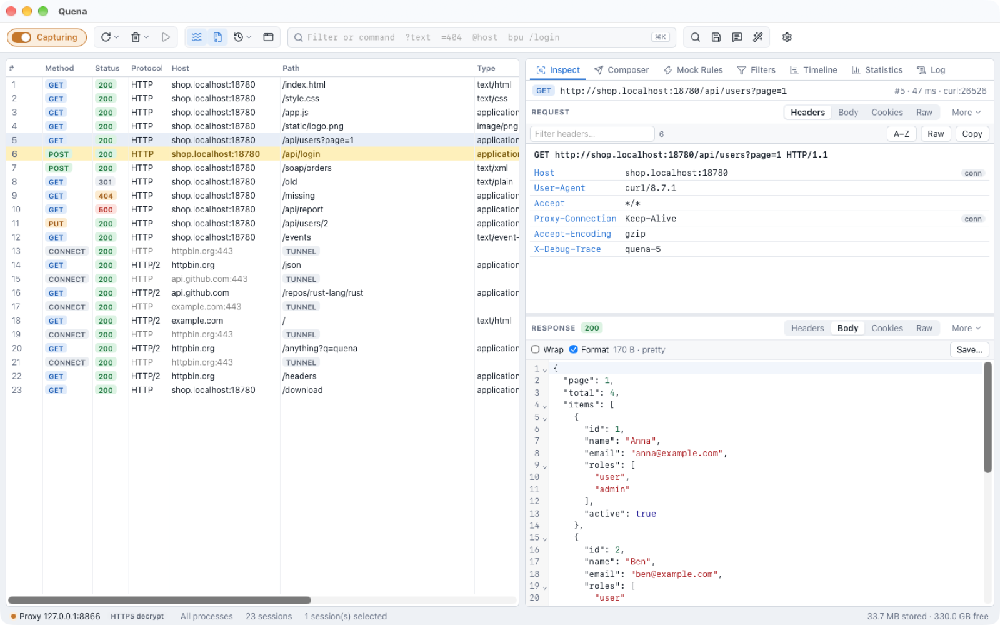

# Settings

Open the settings with the gear button at the right of the toolbar, *Quena → Settings…*
(`⌘ ,`) on macOS, or *Tools → Options…* on Windows and Linux. Changes take effect when you
click **OK**, except for the layout, theme and inspector-view choices, which apply
immediately.

This manual uses the English names of menus and settings.

## General

| Setting | Default | Meaning |
|---|---|---|
| *Layout* | Quena | **Quena** — list left, request and response side by side. **Classic** — dense list, request above response, more columns. |
| *Theme* | Like the system | *Like the system*, *Light* or *Dark*. |
| *Language* | Like the system | *Like the system*, *English* or *Deutsch*. Switching reloads the window and the menus. |
| *Inspector views* | on | Remember the chosen view for each kind of content, separately for request and response (e.g. SOAP → XML, JSON → Body). Shows how many are remembered, with *Forget remembered views*. |
| *Capture traffic on startup* | on | Start capturing when Quena starts. |
| *Stream responses (instead of buffering)* | on | Same as the *Stream* toolbar toggle. |
| *Decode compressed bodies in inspectors* | on | Same as the *Decode* toolbar toggle. |
| *Keep capture data after exit* | off | Keep the capture database after a clean exit. |
| *Offer to recover sessions after a crash* | on | Offer the previous capture at the next start if Quena did not exit cleanly. |

Switching the layout also resets the columns to that layout's set.
*View → Request Above Response / Request Beside Response* changes only the inspector
arrangement.

## Connections

| Setting | Default | Meaning |
|---|---|---|
| *Listen port* | 8866 | The port Quena listens on. |
| *Act as system proxy while capturing* | on | See [System proxy](capture.md#system-proxy). |
| *Allow remote computers to connect* | off | Listen on all interfaces. |
| *Allowed remote networks* | empty (local subnets) | CIDR ranges or addresses, `;`-separated. |
| *Chain to the previous system proxy (upstream gateway)* | on | Forward to the proxy that was active before. |
| *Manual upstream proxy* | empty | `host:port`; overrides the system upstream and PAC. |
| *Bypass upstream for* | `localhost;127.0.0.1;::1;*.local` | Hosts that go direct. |
| *Use the system proxy auto-config (PAC) script* | on | |
| *PAC URL or file* | empty | Overrides the system PAC. |
| *Throttle (kbit/s)* / *Added latency (ms)* | 0 | [Bandwidth simulation](network.md#bandwidth-and-latency-simulation). |

## HTTPS

*Decrypt HTTPS traffic* (off by default), *Decrypt traffic from*, *Skip decryption for*,
*Ignore server certificate errors (unsafe)*, *Ignore certificate errors for*,
*Enable HTTP/2*, *Downgrade to HTTP/1.1 for*, and **Certificate management…** — see
[HTTPS and devices](https.md).

## Authentication

See [Automatic authentication](authentication.md).

## Bodies & Storage

| Setting | Default | Meaning |
|---|---|---|
| *Keep bodies in memory up to (KB)* | 64 | Smaller bodies stay in memory; larger ones go to disk. |
| *Record at most per body (MB)* | 2048 | Longer bodies are forwarded completely but recorded only up to this size. |
| *Storage quota (GB)* | 200 | Disk space the capture may use. |
| *Stop recording below free space (GB)* | 5 | Recording is suspended when the disk gets this full; the status bar says *Recording suspended (disk)*. |
| *Max decoded size (GB)* | 64 | Upper limit for decoded (decompressed) copies of bodies. |
| *Max decompression ratio* | 2000 | Protection against decompression bombs. |
| *Headers only for hosts* | empty | Record only headers for these hosts. |
| *Headers only for content types* | empty | Record only headers for these types, e.g. `video/; audio/`. |
| *Lossless recording (forwarding waits for the disk)* | off | Normally a recorder that falls behind truncates the recording instead of slowing traffic down; with this on, forwarding waits. |

## Data directory

Quena keeps its settings, the capture database, the root certificate, mock rules
(`autoresponder.json`), the rules script (`rules.js`), your plugins (`plugins`) and the
plugin cache (`plugin-cache`) in one folder:

| Platform | Default location |
|---|---|
| macOS | `~/Library/Application Support/Quena` |
| Windows | `%APPDATA%\Quena` |
| Linux | `~/.local/share/Quena` (or `$XDG_DATA_HOME/Quena`) |

The environment variable `QUENA_DATA_DIR` points Quena to another folder.
Captures are stored in the `captures` subfolder; the status bar's storage cell shows the
capture folder in its tooltip.

## Portable mode

If a folder named `quena-data`, or an empty file named `portable`, exists **next to the
Quena executable**, Quena uses `quena-data` as its data directory — on every platform. The
web view's cache and storage are kept there as well, and bundled plugins are found in a
`plugins` folder next to the executable.

The Windows portable ZIP ships in this form. Delete the `portable` file (and `quena-data`)
to use the normal per-user location again.

Things outside the folder that Quena touches only when you use them: the system proxy
(restored on quit), a trusted root certificate (remove it in *HTTPS Settings*), and saved
passwords in the OS secure store.
